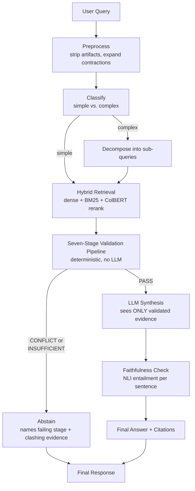

# Trust Before Text

**A deterministic, verification-first Retrieval-Augmented Generation (RAG) system that puts a hard evidence gate between retrieval and the language model, so the model is never invoked on evidence that is missing or contradictory.**

Most RAG systems ask the language model to "only use the provided context" and hope it listens. That's a soft, probabilistic instruction, and it fails silently: when the retrieved documents are noisy, incomplete, or disagree with each other, the model still answers, confidently and often wrongly, filling gaps from its own training data.

Trust Before Text removes that dependency on hope. Between retrieval and generation sits a deterministic, seven-stage validation pipeline with **no language model in it**. It checks whether the retrieved evidence is internally consistent and sufficient to answer the question. Only if both checks pass does the language model get called at all, and even then, it only ever sees the validated evidence, never the raw retrieval output. If the evidence conflicts or falls short, the system abstains and tells the user exactly which documents disagree and why, instead of guessing.

This is a research project: the code, the two evaluation corpora, the experiment harnesses, and the paper draft all live in this one repository.

---

## Table of Contents

1. [Core Philosophy](#core-philosophy)
2. [Architecture](#architecture)
3. [The Validation Pipeline in Detail](#the-validation-pipeline-in-detail)
4. [Repository Structure](#repository-structure)
5. [The Two Evaluation Corpora](#the-two-evaluation-corpora)
6. [Experiments and Headline Results](#experiments-and-headline-results)
7. [The Research Paper](#the-research-paper)
8. [Setup](#setup)
9. [Running the System](#running-the-system)
10. [Configuration Reference](#configuration-reference)
11. [Documentation Index](#documentation-index)
12. [Known Limitations](#known-limitations)
13. [Legacy Code (Not Currently Wired Up)](#legacy-code-not-currently-wired-up)
14. [Repo Hygiene Notes](#repo-hygiene-notes)
15. [License](#license)

---

## Core Philosophy

Six rules the whole codebase is built around:

- **Retrieval maximizes recall.** The retriever's job is to surface everything that might be relevant. It is never the authority on what's relevant enough to answer with; that decision belongs entirely to validation.
- **Validation determines whether evidence is trustworthy.** A dedicated, deterministic stage sits between retrieval and generation and is the *sole* authority on relevance, conflict, and sufficiency.
- **The LLM only synthesizes validated evidence.** It never sees raw retrieval output, never decides whether to answer or abstain, and never touches the vector database directly.
- **Deterministic logic is preferred over LLM-based decision making**, wherever a decision affects safety (answer vs. abstain, conflict vs. no conflict). The same input must always produce the same routing decision.
- **Explainability outranks cleverness.** Every abstention names the failing pipeline stage and, for conflicts, the two specific documents and the values that clash.
- **Architectural separation of responsibilities is preserved.** Retrieval retrieves. Validation validates. Synthesis synthesizes. No stage does another stage's job, even when it would be convenient.

---

## Architecture



The **orchestrator** (`orchestrator.py`) drives this end to end and is the only module that calls every other stage. It is deliberately dumb: it contains no domain logic itself, only the sequencing above and the final routing decision (`proceed` vs `abstain`).

Two properties of this design are the project's central claims, and both follow directly from the fact that steps E and F contain no language model:

- **Determinism.** The routing decision (answer / conflict / insufficient) is a pure function of (query, retrieved chunks). Re-running the same query against the same corpus always produces the same decision.
- **Injection immunity of the decision.** Because there is no LLM in the retrieval-to-validation path, there is no channel through which text hidden in a retrieved document could persuade the *decision* to do anything. It can still poison the evidence itself (see [Known Limitations](#known-limitations)), but it cannot talk the routing logic into ignoring a conflict or answering from insufficient evidence.

The LLM appears in exactly one place: **synthesis**, after the gate, and only on a PASS verdict. It is never in the decision path.

---

## The Validation Pipeline in Detail

All seven stages live in `validation.py` and run for every query, in order. Nothing here calls a language model except Stage 4's semantic fallback (NLI), which is a small, fixed cross-encoder classifier, not a generative model, and it does not make the routing decision itself, it only feeds one signal into it.

| Stage | Name | What it does |
|---|---|---|
| 1 | Chunk Normalization | Removes empty chunks, normalizes whitespace and Unicode. |
| 2 | Duplicate Removal | Cosine-similarity dedup; keeps the highest-scoring copy of near-identical chunks. |
| 3 | Relevance Filtering | Drops chunks below a query-relevance floor, so only evidence actually about the question reaches conflict/sufficiency checks. |
| 4 | Evidence Consistency (conflict detection) | Three-pronged: cheap keyword/antonym check first, then unit-aware numeric comparison, then a semantic NLI cross-encoder (`cross-encoder/nli-deberta-v3-base`) for contradictions that share no vocabulary. |
| 5 | Evidence Sufficiency | Passes if `avg calibrated score ≥ 0.65` **OR** `query-term coverage ≥ 0.55`. Either signal alone is enough. |
| 6 | Evidence Structuring | Adds a `rank` field, enforces descending-score order for the synthesis prompt. |
| 7 | Abstention Decision | Emits a named reason: `"conflict"`, `"insufficient"`, or `None` (proceed to synthesis). |

### The key thresholds (all in `validation.py`, all overridable via env var)

| Constant | Default | What it gates |
|---|---|---|
| `MIN_CHUNK_SCORE_THRESHOLD` | 0.60 | Hard floor: chunks below this never reach Stage 4/5 at all. |
| `MIN_AVG_SCORE_FOR_SUFFICIENCY` | 0.65 | Sufficiency signal H2 (average evidence quality). |
| `MIN_QUERY_COVERAGE` | 0.55 | Sufficiency signal H4 (fraction of query content-words covered by evidence). |
| `CONFLICT_SIM_THRESHOLD` | 0.68 | Lexical-overlap floor for the cheap keyword/numeric conflict checks only. |
| `NLI_SIM_FLOOR` | 0.15 | Performance-only floor below which NLI is skipped as unrelated (deliberately kept low so paraphrastic contradictions still reach NLI). |
| `NLI_CONFLICT_THRESHOLD` | 0.94 | Confidence a passage pair must reach on the NLI cross-encoder to be called a contradiction. Calibrated on the primary corpus, not a universal constant. |

These thresholds are the project's own documented distinction between **structural** guarantees (true by construction, corpus-independent: determinism, conflict recall, injection immunity of the decision) and **calibrated** numbers (tuned to one corpus's score distribution: raw accuracy, conflict precision, the exact threshold values above). See [Known Limitations](#known-limitations).

### Retrieval backend (`qdrant_retrieval.py`, `retrieval_interface.py`)

Hybrid retrieval over a local Qdrant collection with three named vectors per chunk:

- **dense**: `sentence-transformers/all-MiniLM-L6-v2` embeddings, for semantic similarity.
- **sparse**: local BM25-style lexical vectors with Qdrant's IDF modifier, for exact-term matching.
- **multi**: `answerdotai/answerai-colbert-small-v1` token-level multivectors, used to rerank the dense+sparse candidates.

`retrieval_interface.py` is the single import point every other module uses (`from retrieval_interface import retrieve`); it delegates to whichever backend is configured (currently only `qdrant`, set via `RAG_RETRIEVER`). This indirection is what lets the experiment harnesses point retrieval at a different Qdrant directory (e.g. the second corpus) without editing any frozen pipeline file; see [Repo Hygiene Notes](#repo-hygiene-notes).

### Synthesis (`synthesis.py`, `llm_interface.py`)

The only stage that calls a language model. Constraints enforced by construction:

- Receives **only** validated, ranked evidence chunks and flags: never raw retrieval output, never the vector DB, never external tools.
- Does not retrieve, validate, or make routing decisions; those are already finished by the time synthesis runs.
- After generation, each sentence of the answer is checked for NLI entailment against the evidence (reusing the same NLI model Stage 4 already loaded, no extra cost). This produces a `faithfulness_score` and flags any sentence the model wrote that isn't actually supported by the evidence, catching cases where the model added knowledge despite the constrained prompt.

LLM backend priority (`llm_interface.py`), first key found in `.env` wins: **Groq** (`llama-3.3-70b-versatile`) → **OpenAI** (`gpt-4o-mini`) → **Google Gemini** (`gemini-1.5-flash`) → a deterministic **Mock** backend that needs no key at all, so the full pipeline (including validation) runs and is testable with zero API cost.

---

## Repository Structure

```
Major Project/
│
├── README.md                        This file.
├── claude.md                        Project instructions for AI-assisted development
│                                     (philosophy, dev process, "ask before implementing").
├── requirements.txt                 Python dependencies.
├── .env                             API keys (gitignored). See Configuration Reference.
├── .gitignore
│
├── STATUS.md                        Shared dashboard across the project's working chats/
│                                     sessions: what's done, what's decided, what's next.
│                                     Read this first if you want the current state of the
│                                     whole project in one place.
│
├── ── CORE PIPELINE (the system itself) ──────────────────────────────────
├── orchestrator.py                  Drives the full pipeline: preprocess → classify →
│                                     [decompose] → retrieve → validate → decide → [synthesize].
├── retrieval_interface.py           Single import point for retrieval; delegates to a backend.
├── qdrant_retrieval.py               Qdrant hybrid retrieval backend (dense + BM25 + ColBERT).
├── retrieval_scoring.py             Shared score calibration (raw cosine → calibrated score).
├── validation.py                     The seven-stage deterministic validation pipeline.
├── synthesis.py                      LLM answer generation from validated evidence only,
│                                     plus post-hoc faithfulness verification.
├── llm_interface.py                 LLM backend selection (Groq / OpenAI / Gemini / Mock).
├── document_preprocessing.py        Document loading and chunking (DOCX/PDF/TXT).
├── ingestion.py                     Builds the DOCX section map used for citation labeling.
├── utils.py                          Shared text-cleaning and similarity helpers.
│
├── ── ENTRY POINTS ────────────────────────────────────────────────────────
├── main.py                           CLI entry point: interactive REPL, single query,
│                                     demo mode, forced re-ingest, or index status.
├── api.py                            FastAPI server: /query, /upload, /reset, /stats,
│                                     /documents. Backs the frontend/ dashboard.
├── frontend/                         Static web dashboard (talks to api.py on :8000).
│   ├── index.html
│   ├── app.js
│   └── style.css
│
├── ── CORPUS 1: Meridian Grid HR (UK enterprise policy, primary corpus) ──
├── data/
│   ├── *.docx                       11 authored HR policy documents (incl. one
│   │                                 deliberately superseded pair) for a fictional
│   │                                 UK company, written to a fixed, known fact map.
│   ├── ground_truth.json / .md      Every planted fact, conflict, and gap, with sources.
│   ├── queries.json / .md            78 evaluation queries (46 answer / 16 conflict /
│   │                                 16 insufficient).
│   ├── phase5_verification_report.md, phase6_*        Earlier-phase run reports.
│   │                                 NOTE: phase6_fullrun_results*.json are v4/v5 system
│   │                                 snapshots, NOT the current (v6) system, don't cite
│   │                                 them as current numbers (see experiments/ instead).
│   └── _old_corpus/                 The original 10-document, 30-query corpus used for
│                                     the very first evaluation (Report 1.md). Superseded
│                                     by the corpus above; kept for provenance.
│
├── ── CORPUS 2: Ashcombe Falls University (US academic regs, generalization test) ──
├── data_corpus2/
│   ├── *.docx                       11 independently authored academic-regulation
│   │                                 documents for a fictional US university, deliberately
│   │                                 different domain, national convention (semester/
│   │                                 credit-hour vs UK statutory leave), and vocabulary
│   │                                 from Corpus 1, following the same fixed-fact-map method.
│   ├── ground_truth.json            46 facts, 4 planted conflicts, 6 gaps.
│   └── queries.json                 78 queries, same category structure as Corpus 1
│                                     (for a controlled comparison, see
│                                     experiments_corpus2/CORPUS2_REPORT.md).
│
├── ── EXPERIMENTS: Corpus 1 (E1-E5, the adversarial/robustness study) ────
├── experiments/
│   ├── MASTER_REPORT.md             Single source of truth for every Corpus-1 experiment
│   │                                 number used in the paper. Start here.
│   ├── our_decisions.py / .json      Regenerates the frozen system's decisions on all 78
│   │                                 queries, decision-layer only, zero LLM tokens.
│   ├── baseline_experiment.py / .json / _summary.md / _chart.png / baseline_per_query.json
│   │                                 E1: prompted-LLM baseline (same evidence, same
│   │                                 queries), the accuracy/consistency/leakage/
│   │                                 attribution comparison.
│   ├── scale_test.py / scale_results*.json
│   │                                 E2: buried-conflict-at-scale stress test (conflict
│   │                                 recall as distractor document count grows).
│   ├── haystack_test.py / haystack_results*.json / _summary.md / _chart.png / make_haystack_report.py
│   │                                 Supporting "needle in a haystack" retrieval study.
│   ├── injection_test.py / injection_results*.json / _summary.md / _chart.png / make_injection_report.py
│   │                                 E3: fixed prompt-injection attack (direct / authority /
│   │                                 exfiltration) against the routing decision and synthesis.
│   ├── synth_hardening_test.py / hardening_injection*.json / hardening_summary.md / hardening_chart.png
│   │                                 E4: synthesis-layer hardening (evidence delimiters +
│   │                                 anti-injection prompt), closes the synthesis exposure
│   │                                 E3 found.
│   ├── adaptive_decision_test.py / adaptive_results*.json / adaptive_summary.md / adaptive_chart.png
│   │                                 E5 (the flagship): adaptive, escalating attacks aimed
│   │                                 at the safety DECISION itself, plus the fabricated-
│   │                                 evidence poisoning bound.
│   ├── make_report.py               Regenerates MASTER_REPORT.md from the raw JSON.
│   ├── baseline_section_V_E_report.md
│   │                                 Baseline write-up handed off for the paper's evaluation
│   │                                 section.
│   └── clean_before.json / clean_after.json
│                                     Clean-query (non-adversarial) control runs bracketing
│                                     the hardening experiment.
│
├── ── EXPERIMENTS: Corpus 2 (generalization test) ────────────────────────
├── experiments_corpus2/
│   ├── CORPUS2_REPORT.md            Full generalization report: what held (determinism,
│   │                                 conflict recall, structural attribution, injection
│   │                                 immunity) vs what drifted (accuracy, conflict
│   │                                 precision, unsafe-answer rate) moving to a new domain,
│   │                                 with root causes diagnosed for each drift.
│   ├── our_decisions_corpus2.py / .json
│   │                                 Regenerates the frozen system's decisions on all 78
│   │                                 Corpus-2 queries (same technique as experiments/
│   │                                 our_decisions.py, retrieval repointed at
│   │                                 qdrant_db_corpus2/ via a monkeypatch, no frozen
│   │                                 pipeline file is edited to do this).
│   ├── baseline_experiment_corpus2.py / baseline_results_corpus2*.json
│   │                                 Prompted-LLM baseline run on Corpus 2.
│   ├── diagnose_gap_leakage.py / gap_leakage_diagnosis.json
│   │                                 Read-only diagnosis of the 4 gap queries that leaked
│   │                                 an answer instead of abstaining on Corpus 2: which
│   │                                 branch of the sufficiency gate let each one through.
│   └── injection_spotcheck_corpus2.py / .json
│                                     Small decision-layer-only injection spot-check on
│                                     Corpus 2, closing the "flagship only tested on one
│                                     corpus" gap.
│
├── ── RESEARCH PAPER ────────────────────────────────────────────────────
├── paper_assets/
│   ├── trust_before_text.tex        The paper draft (IEEE format).
│   ├── references.bib               Curated BibTeX reference list.
│   ├── sec2_related_work.tex, bib_entries_new_and_corrected.tex
│   │                                 Supporting draft fragments.
│   ├── make_figures.py              Regenerates the matplotlib figures below from the
│   │                                 experiment JSON.
│   ├── fig4_confusion_matrix.*, fig5_ablation.*, fig6_nli_separation.*
│   │                                 Generated figures (PDF for LaTeX, PNG for preview).
│   └── fig3_conflict_flow.drawio    Editable source for the conflict-flow diagram.
│
├── ── STANDALONE REPORTS AND LOGS (root) ───────────────────────────────────
├── RAG_System_Observation_Log.md    Running, append-only log of every correctness issue
│                                     ever found in the pipeline: what broke, why, the fix,
│                                     and the measured before/after effect. The project's
│                                     primary paper-trail document.
├── Report 1.md                       Evaluation report on the original 10-doc/30-query
│                                     corpus (data/_old_corpus/), an early snapshot, since
│                                     superseded by Report 2.
├── Report 2.md                       Evaluation report on the current 78-query Meridian
│                                     Grid corpus (v6): 92.3% decision accuracy, 0 unsafe
│                                     answers, all remaining errors safe over-caution.
│
├── ── EXAMPLES AND TESTS (legacy, see note below) ─────────────────────────
├── examples/                         Standalone usage scripts. See
│   └── (4 scripts)                   "Legacy Code" section: these import a
│                                     `retrieval_module` that predates the current Qdrant
│                                     backend and is no longer in this repo.
├── tests/                             Unit tests, same legacy-import caveat as examples/.
│
├── ── GENERATED / RUNTIME (not hand-authored) ──────────────────────────────
├── qdrant_db/                         Corpus-1 vector store. Gitignored; rebuilt by ingestion.
├── qdrant_db_corpus2/                Corpus-2 vector store. See Repo Hygiene Notes: this
│                                     one is currently NOT gitignored.
└── __pycache__/                       Python bytecode cache. Gitignored.
```

---

## The Two Evaluation Corpora

The system is evaluated on two independently authored corpora, deliberately chosen to differ in domain, national convention, and vocabulary, so any difference in results can be attributed to the corpus rather than to test-set overlap.

| | Corpus 1: Meridian Grid HR | Corpus 2: Ashcombe Falls University |
|---|---|---|
| Domain | UK employment / HR policy | US academic regulations |
| Convention | UK statutory leave, GBP, HMRC mileage | US semester/credit-hour, USD, FAFSA |
| Documents | 11 (incl. 1 superseded pair) | 11 (incl. 1 superseded pair) |
| Facts | 45 | 46 |
| Planted conflicts | 4 | 4 |
| Gaps (deliberately unanswerable) | 6 | 6 |
| Queries | 78 (46 answer / 16 conflict / 16 insufficient) | 78 (same structure) |

Both corpora are authored to a fixed, known fact map before any query is written, so ground truth is exact by construction rather than hand-labeled afterward. Every fact and conflict is text-verified programmatically against the generated documents before any evaluation run.

Each corpus has its own Qdrant vector store (`qdrant_db/` and `qdrant_db_corpus2/`) and its own experiment folder (`experiments/` and `experiments_corpus2/`). The pipeline code itself (`orchestrator.py`, `validation.py`, `synthesis.py`) is never edited between the two; only the retrieval target changes, via a monkeypatch in the Corpus-2 driver scripts, never a code edit to a frozen file.

---

## Experiments and Headline Results

*Full numbers, methodology, and honest caveats live in `experiments/MASTER_REPORT.md` and `experiments_corpus2/CORPUS2_REPORT.md`. This is a summary, not a substitute.*

| Metric | Corpus 1 (ours) | Corpus 1 (prompted-LLM baseline) | Corpus 2 (ours) | Corpus 2 (baseline) |
|---|---|---|---|---|
| Decision accuracy | 92.3% (72/78) | 97.4% | 66.7% (52/78) | 98.7% |
| Conflict recall | 100% (16/16) | 93.75% (15/16) | 100% (16/16) | 93.75% (15/16) |
| Unsafe answers | 0 / 32 | 1 / 32 | 4 / 32 | 1 / 32 |
| Decision flips across reruns | 0% | 1.3% | 0% | 1.3% |
| Decision-layer injection obeyed | 0 / 45 | n/a | 0 / 15 (spot-check) | n/a |

**The honest headline is not that this system is more accurate.** On both corpora, a well-prompted large language model given the same evidence matches or beats it on raw accuracy. What holds on both corpora, unchanged, is the set of properties that don't depend on any language model being well-behaved: the routing decision never flips between reruns, it never misses a planted conflict, and it cannot be talked into ignoring one by hostile text hidden in a document, because there is no language model in that decision to persuade. Everything that *is* calibrated to one corpus (raw accuracy, conflict precision, the exact threshold values) measurably drifts on the other, and the two failure modes behind that drift on Corpus 2 are diagnosed, not just observed, in `CORPUS2_REPORT.md`.

The one shared blind spot: a fabricated fact that reads as plausible and scores well defeats **both** systems equally, since neither can currently tell a fabricated piece of evidence from a real one. That is stated openly as an unsolved problem, not glossed over.

---

## The Research Paper

`paper_assets/trust_before_text.tex` is the in-progress paper draft (target: IEEE Access), built entirely from the numbers in `experiments/MASTER_REPORT.md` and `experiments_corpus2/CORPUS2_REPORT.md`. Its central claim mirrors the project's own thesis: the contribution is a deterministic, auditable safety *guarantee*, not a higher accuracy score. `paper_assets/references.bib` holds the curated bibliography (BibTeX/IEEEtran format).

---

## Setup

**Requirements:** Python 3.10+, and at least one LLM API key if you want real (non-mock) answers.

```bash
pip install -r requirements.txt
```

Create a `.env` file in the project root (never commit this file, it's gitignored):

```
GROQ_API_KEY=your-key-here
# Optional fallbacks:
# OPENAI_API_KEY=your-key-here
# GEMINI_API_KEY=your-key-here
```

With no key set at all, the system still runs end to end using a deterministic Mock LLM backend, useful for testing the retrieval and validation pipeline without any API cost.

---

## Running the System

**Interactive CLI:**
```bash
python main.py                        # interactive REPL
python main.py "What is the leave policy?"   # single query
python main.py --demo                 # run built-in demo queries covering every pipeline branch
python main.py --ingest                # force re-ingest all documents into Qdrant
python main.py --status                # show collection info and exit
```

**API + web dashboard:**
```bash
python api.py            # or: uvicorn api:app --reload
```
Then open `frontend/index.html` (or serve it): it talks to the API on `http://localhost:8000` for querying, uploading documents, viewing corpus stats, and resetting the index.

---

## Configuration Reference

All environment variables read by the pipeline. All are optional; each falls back to the hand-calibrated default shown.

| Variable | Default | Purpose |
|---|---|---|
| `GROQ_API_KEY` (+ `_2`...`_7`) | none | Primary LLM backend, with rotating keys for the experiment harnesses' higher call volume. |
| `OPENAI_API_KEY` | none | Fallback LLM backend. |
| `GEMINI_API_KEY` | none | Second fallback LLM backend. |
| `RAG_RETRIEVER` | `qdrant` | Retrieval backend selector. |
| `RAG_RETRIEVAL_TOP_K` | 30 | Chunks fetched per (sub-)query. |
| `RAG_MIN_CHUNK_SCORE_THRESHOLD` | 0.60 | Stage 3 hard relevance floor. |
| `RAG_MIN_AVG_SCORE_FOR_SUFFICIENCY` | 0.65 | Stage 5 sufficiency signal H2. |
| `RAG_MIN_QUERY_COVERAGE` | 0.55 | Stage 5 sufficiency signal H4. |
| `RAG_CONFLICT_SIM_THRESHOLD` | 0.68 | Lexical-check gate for Stage 4. |
| `RAG_NLI_SIM_FLOOR` | 0.15 | Performance floor below which NLI is skipped. |
| `RAG_NLI_CONFLICT_THRESHOLD` | 0.94 | NLI contradiction confidence floor for Stage 4. |

**Do not tune these against the evaluation corpora and call the result an improvement without re-reading `experiments/MASTER_REPORT.md` §"Structural vs. calibrated" first.** Several of them are deliberately corpus-calibrated, and the project's own honesty standard requires saying so whenever they change.

---

## Documentation Index

This repository documents itself heavily. If you're looking for something specific:

| Document | What it's for |
|---|---|
| `STATUS.md` | Current state of the whole project, right now: read this first. |
| `RAG_System_Observation_Log.md` | Every correctness issue ever found, with fix and measured effect. The full build history. |
| `Report 1.md` | Original 10-document evaluation (superseded). |
| `Report 2.md` | Current (v6) 78-query Corpus-1 evaluation: 92.3% accuracy, 0 unsafe answers. |
| `experiments/MASTER_REPORT.md` | Every Corpus-1 experiment number (E1–E5), consolidated. Source of truth for the paper. |
| `experiments_corpus2/CORPUS2_REPORT.md` | The generalization study: what held vs. drifted moving to a new domain, with diagnosed root causes. |
| `paper_assets/trust_before_text.tex` | The paper draft itself. |
| `claude.md` | Development process and philosophy for AI-assisted contributions to this codebase. |

---

## Known Limitations

Stated plainly, because the project's own standard is to never understate a weakness:

- **Accuracy is not the contribution.** A well-prompted LLM given the same evidence matches or beats this system's raw accuracy on both corpora. Every error this system makes is a safe, over-cautious abstention, never a confident wrong answer, but it is still an error.
- **Conflict detection is query-unscoped.** It compares every retrieved cross-document pair, not just pairs relevant to what was actually asked. This is the root cause of most false-conflict flags, and it gets measurably worse when two documents genuinely conflict on one fact but also happen to share a lot of unrelated wording (e.g. a superseded policy and its replacement).
- **Sufficiency thresholds are corpus-calibrated, not universal.** Moving to a new domain without re-tuning can let the sufficiency gate admit topically-adjacent but non-answering evidence (this is exactly what happened on Corpus 2, diagnosed in `experiments_corpus2/CORPUS2_REPORT.md`, not swept under the rug).
- **The synthesis layer is a real exposed surface.** Only the routing decision is immune to injection by construction. The answer-writing step does call an LLM and can be hijacked; prompt-hardening closes most of the gap but only to parity with a defended LLM, not to a structural guarantee.
- **Fabricated evidence defeats the system.** It can tell whether documents *agree with each other*; it cannot tell whether a document is *authentic*. A convincing fabricated fact passes the same evidence gate a real one would. Both this system and a prompted LLM fail here equally.

---

## Legacy Code (Not Currently Wired Up)

`examples/*.py` and `tests/*.py` import a module called `retrieval_module`, which predates the current Qdrant-based retrieval backend (`retrieval_interface.py` / `qdrant_retrieval.py`) and no longer exists in this repository. These files are kept for reference but will not run as-is against the current architecture. If you want a working, current entry point, use `main.py` or `api.py`.

---

## Repo Hygiene Notes

A few things worth doing before treating this as a clean `main` branch:

- **`qdrant_db_corpus2/` is not in `.gitignore`.** `qdrant_db/` (Corpus 1's store) is excluded, but the Corpus-2 equivalent currently isn't, so `git add .` will pull in several megabytes of generated binary vector-store data. Consider adding `qdrant_db_corpus2/` to `.gitignore` alongside `qdrant_db/`.
- **`data/phase6_fullrun_results*.json` are stale system snapshots** (v4/v5, not the current v6 pipeline), kept for provenance, but don't cite them as current numbers; use `experiments/our_decisions.json` instead.

---

## License

No `LICENSE` file currently exists in this repository. Without one, default copyright applies and others have no explicit right to reuse this code. Add one before treating the repository as public or shareable, if that's the intent.
